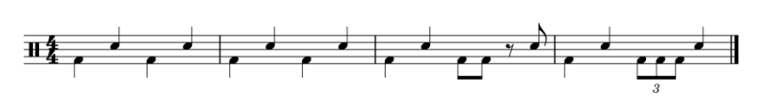
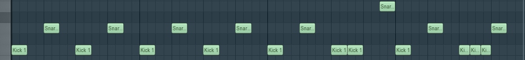
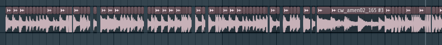

# Tuplet

an esoteric, programmatic music notation geared towards breakcore production

## Background

Breakcore is a subgenre of electronic music characterized by meticulous,
rapid-fire splicing of drum loops. The preferred method of creation for
many breakcore artists involves manually cutting and positioning audio
clips to a note grid in a digital audio workstation (DAW).

The main source of friction when working in a DAW is that it's relatively
slow (it is manual splicing, after all). Additionally, when doing complex
rhythmic patterns, it can be difficult to make changes without deleting
and remaking the part of the measure you want to change. The goal of
Tuplet, then, is to make writing and editing complex rhythms easier.

Other ways to programmatically define music with text do already exist,
howewever there are few that are particularly suited for this
domain. Many focus on procedural patterns and sound design, like
[Chuck](https://chuck.cs.princeton.edu/) and [Glicol](https://glicol.org/).
Others, like [Music Macro Language](https://en.wikipedia.org/wiki/Music_Macro_Language),
are built for other domains (in this instance, chiptune).

While writing this design doc, we discovered [Tidal Cycles](http://tidalcycles.org/),
a language that, alongside synthesis, has much of the patterning functionality
we aim to implement in Tuplet (and then some). It also is built around
live-coding, ~~and I (Aiden) am probably going to play with it more in my free time~~.
However, it appears to lack the binding ergonomics we wish to include in Tuplet,
and it seems geared more towards writing small patterns that layer atop one another
than building long tracks.

## Domain Concepts

### Note

A note is a single sound played for a period of time. It can be pitched or unpitched.

### Beat

A beat is a single unit of time in music. The length of notes is often described
in beats. For example, often a "whole note" is four beats, a "half note" is two beats,
a "quarter note" is one beat, an "eighth note" is half a beat, etc.

### Tempo

The tempo is the rate of beats in a song, often defined as minutes per second.

### Rest

Has the same descriptions of length as a note, but denotes a pause in playing.

### Measure

A unit of a grouping of beats. A series of measures composes a song. Each measure
has a length defined by the song or section's time signature, which is represented
with two numbers. The top number is the number of beats in a measure, and the bottom
number is the type of note that constitutes a single beat. For example, a measure
in 4/4 consists of the length of time of four quarter notes. A measure in 7/8
consists of the length of time of seven eighth notes.

### Tuplet

A series of notes that are fit into a number of beats they normally would not.
For example, fitting three eighth notes into the space of one quarter note.

## Linguistic Features

### Oneshot

In Tuplet, a oneshot is a named binding, which can be a note,
pattern, or tuplet.

### Note

Instead of including a pitch, a note is a single audio sample loaded from
an audio file. It can be passed into functions that apply transformations
to single notes, such as pitch shifting or reversing.

Additionally, there will be syntax allowing the user to splice a single
file into muliple notes based on a pattern. (See the breakcore example
below for more information.)

### Pattern

A pattern is a sequence of oneshots. This sequence does not stretch
or squeeze its contents. Instead, placing a pattern is treated the
same as if each oneshot contained within the pattern was placed
manually. The main purpose of patterns is to reuse common snippets,
additionally allowing the flexibility of using the same pattern at
different speeds.

### Tuplet

A tuplet is also a sequence of oneshots. Unlike patterns, however,
tuplets will stretch or squeeze its contents to fit into the number
of beats provided when a tuplet is written. Using tuplets is the
primary means of which rhythms are described in Tuplet.

If you're familiar with web development, you can think of tuplets
as similar to flex containers, which notes having a flex-grow of
1, and n-tuplets having a flex-grow of n.

### Track

A track is a sequence of tuplets that are played at a given tempo.
We plan to have functions that can play a track as audio, export a
track to an audio file, and export a track to a MIDI file.

Of note, the fact that a track is a sequence of tuplets makes relatively
complex concepts like time signature changes and irregular time signatures
an easy and natural part of the language. Really, what is a measure if not
a pattern of notes fit into a given number of beats?

## Examples

### Simple Rhythm

```
(let o (load-file “kick.wav”))
(let x (load-file “snare.wav”))
(let pitched (pitch x 5)) ; pitched up 5 semitones
(let pattern (o x o x))
(let triplet (1 o o o))
(let rest (1))
(track “track_1” 150 (
  (4 o x o x) ; these two measures
  (4 pattern) ; are equivalent
  (4 o x (1 o o) (1 rest pitched))
  (4 o x triplet x)
))
```

This is a very basic example of a track defined using Tuplet's proposed syntax.
Each measure is in 4/4, with a simple beat consisting of loaded kick and snare
samples. Tuplets are used both inlined in the track and bound to a name to
create eighth notes and eighth note triplets. A rest is created by defining
an empty tuplet. The `pitch` function is used to defined a pitched up copy
of the snare drum sample.

This is what an equivalent beat would look like when written in music notation
and FL Studio, respectively:




### "Polyriddim"

```
(let w (load-file “wub.wav”))
(let _ (1))
(track “polyriddim_drop_wubs” 122.5 (
  (7 (3 _ w w w w w w) (4 _ w w w w w w w w w w))
  (7 (14 (3 _ w w w) w (2 _ w w) (8 (3 _ w w w) (3 w w w w) w w w w w)))
  (7 (3 _ w (3 w w w w) (2 w w w w)) (1 _ w w) (1 w w w w) (1 w w w w w) (1 w w w w w))
  (7 (1 _ w w) (1 w w w) (1 w w w) (4 _ w w w w (6 (2 w) w w w w w w w w w)))
  (7 _ _ (1 _ w w w w) (1 _ w w w w) (1 w w w w w) (1 w (1 w w)) (1 w w w w))
  (7 (2 _ w w w w (1/2 w)) (1 _ w w w) (1 _ w w w) (1 w w w w) (1 w w w w) (1 w w w w))
  (7 _ _ (1 _ w w w w) (1 _ w w w w) (1 w w w w w w) (1 w (1 w w)) (1 w w w w w))
  (7 (1 w w w w) (1 w w w w) (5 (1 w w w) (1 w w) (3 w w w w w w w w)))
))
```

The song "polyriddim" by phonon is a dubstep track with idiosyncratic rhythms during the
drops, most notably featuring heavy use of nested tuplets. (A live drummed
example of this, alongside music notation, can be watched
[here](https://www.youtube.com/watch?v=xv05y31U1p4&t=827)). In this example,
the first drop of "polyriddim" is used as a stress test for the expressivity
and flexibility of Tuplet's rhythmic notation. Nested tuplets are, in fact,
a very natural part of the language, allowing for some very complex
rhythms to be rapidly written. Because tuplets fit the contents to the number
of beats specified, something like `(7 (14 ...))` allows the user to work
in terms of eighth notes, instead of quarter notes.

### Breakcore

```
(let (k1 k2 s1 (3 h1 s2 h2 s3 k3 k4) s4 (1 r1 r2) k5 k6 s5 (3 h3 s6 h4 s7 (2 s8)) (2 h5)) (load-file-split “cw_amen02_165.wav”))
(let _ (1)) (let two_snare (1 s1 s1)) (let two_kick (1 k1 k2))
(let ss_s (1 two_snare s1) (let s_ss (1 s1 two_snare))) (let kk_s (1 two_kick s1) (let s_kk (1 s1 two_kick)))
(let h5_pitched (pitch h5 2)) (let s1_pitched (pitch s1 2)) (let k2_pitched (pitch k2 -2)) (let s1_pitched_2 (pitch s1 4))
(let pattern1 (two_kick s_ss (1 h2 h1 k3 k3)))
(track “breakcore_beat_part1” 180 (
  (4 pattern1 (1 s1 (1 s3 r1)))
  (4 (1 k1 (1 s1 s1 s1 s1 s1 _)) s_kk (1 h4 _ h3 _) (h5 h5_pitched))
  (4 (1 k1 (1 k1 k1)) (1 s1 k3 h1 k3) (1 s3 _ h2 k1) (1 s1 s1_pitched))
  (4 (1 k1 k1) (1 ss_s (1 k1 _)) (1 s1 (1 k1 _)) (1 s1 ss_s))
  (4 pattern1 (1 (k1 (1 s1 _)) s1))
  (4 (1 h1 _ (2 s3)) (1 k2 k2 k2 _) (1 h5 (1 _ (2 h2) _)) h5)
  (4 k1 k2 s1 (1 h1 s2))
  (4 (2 (2 h5) s1 s1 s1 h1 (2 k1)) (1 (1 s1 s1 s1 s1) k2) (1 (2 s1 s1 s1 s1 s1 s1 s1 _) s1_pitched_2 s1_pitched))
))
```

Finally moving to an example within the intended domain, this is eight measures
of the drum splicing of a breakcore excerpt. The actual song can be listened to
[here](https://youtu.be/afmh_KJUBbI?t=21). The first aspect of note is how a
pattern is used to bind segments of an amen break into names. Otherwise, the
rest of the example is fairly straightforward, using the features covered
in the previous examples. While it may still be somewhat complicated to
glance at, the rate at which changes can be made and tested is much
higher than other ways one would write the same beat.

Once Tuplet is implemented, the exported audio would be equivalent to the
manual splicing seen here:



## Syntax

## Implementation Milestones

The following is a rough outline and explanation of the steps we will
take to implement this language.

### Define data representations for oneshots and tuplets

The majority of our language's functionality is encoded by the data
that the user defines. The reason why patterns aren't included is
because they would likely directly be implemented via macros. We
may also build a intermediate "flattened" data representation
generalized for track exports.

### Implement runtime functions for loading and exporting oneshots

Before implementing the core functionality, we'd like to ensure
the audio pipeline works as intended, simply from load to export.

### Implement runtime functions for “squeezing” and exporting tuplets

The core functionality is implemented in this step. We would likely
process the track to a "flattened" track that is then passed to functions
for audio or MIDI export.

### Implement macros (including syntax checks) for tuplets

These macros allow us to get closer to our intended surface syntax. We
decided to do this first because it is the most integral feature to
get right, syntax-wise.

### Implement macros (including syntax checks) for variable binding

Adding basic variable binding will greatly improve the ergonomics of our language.
Binding based on a pattern structure will be added much later.

### Implement macros (including syntax checks) for patterns

Once we add syntax for patterns (which only exist in syntax), we can build
tracks identical to the examples (though the variable definitions will have
to be different to compensate for a lack of features).

### Add utility functions for transforming oneshots (e.g. reverse, pitch shift)

These functions would improve the ergonomics of loading and using files,
since you don't have to bounce to a different piece of software to accompolish
common edits to an audio sample.

### Add runtime functions and macro (including syntax checks) for splicing samples during load

This is an arguably less crucial, yet still important feature for our language.
It builds off of previous work on patterns, loading files, and tuplet squeezing.

### Add MIDI export

MIDI export isn't super necessary, but it's a nice-to-have that shouldn't be
difficult to add, assuming we did our previous steps sufficiently.
